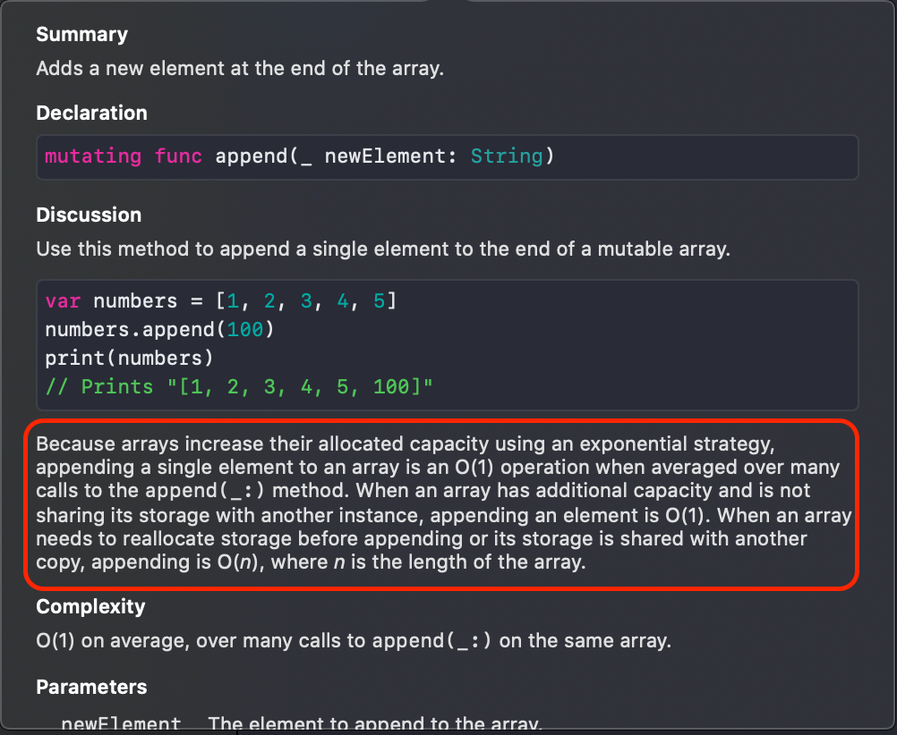

# Array

### 배열이란

정의
* 같은 타입의 요소들을 모아놓은 자료구조
* 값의 설정, 검색이 가능하며 인덱스는 연속적인 정수로 저장된다
* 대부분의 프로그래밍 언어는 0부터 인덱스를 시작하며, get, set, insert, delete 같은 메서드들을 가진다

### 배열의 세가지 특징

1. 어떤 타입이든 지정가능하다

```swift
let ints = [Int]() // 정수
let strings = [String]() // 문자열
let people = [Person]() // 사용자 정의 타입
```

2. 고정된 크기(size)를 가지고 있다

3. 무작위 접근이 가능하다
* 리스트, 스택, 큐, 바이너리 서치 트리 등은 인덱스로 무작위 접근이 불가능하다
* 하지만 배열은 무작위 접근이 가능해서 인덱스만 알고 있다면 O(1)으로 원하는 데이터를 얻을 수 있다 

### Get/Set

데이터 획득, 설정
* 무작위 접근이 가능하므로 인덱스를 인자로 Get, Set 메서드를 사용하면 O(1)의 효율로 데이터를 획득, 설정할 수 있다

### Insert

자료 삽입
* 자료 삽입은 내부적으로 세 가지 동작을 수행한다
  1. 복사
  2. 삽입
  3. 인덱스 증가

* 예시
- 문자열 a, c, d가 저장된 배열이 있다고 가정해보자
- 이 문자열에 insert 메서드의 인자로 삽입할 인덱스를 가리키는 정수값 1과 문자열 b를 넘기면
- 우선 지정된 인덱스 이전의 기존 배열을 복사하고 인덱스 1을 비운뒤 나머지 값들을 순차적으로 저장한다
- 지정된 인덱스에 값을 저장한다
- 배열의 인덱스를 증가시킨다
- 최악의 경우 모든 배열의 인덱스를 1씩 이동시켜야 하므로 O(n)의 효율을 가진다

### Delete

자료 삭제
* Insert와 다르게 삭제는 지정된 인덱스의 요소를 제거하고 해당 인덱스보다 뒤에 있는 요소들을 1씩 앞당기며 복사한다
* Insert와 마찬가지로 최악의 경우 모든 배열의 요소를 1씩 이동시켜야 하므로 O(n)의 효율을 가진다

### 배열 리사이징

예시
* 문자열 a, b, c, d가 저장되어 있는 사이즈가 4인 배열이 있다
* add 메서드로 문자열 e를 추가한다면 배열의 크기를 증가시켜야 한다

내부 동작
1. 자신의 사이즈의 두 배로 공간을 만든다(create x2). 이 경우 사이즈 8의 배열이 생성된다
2. 기존 요소들을 차례대로 복사해넣는다
3. 새로 입력될 공간을 가리킨다
4. 가리키고 있는 공간에 새 요소를 삽입한다


* Xcode에서 확인할 수 있듯이 일반적으로는 O(1)의 효율을 가지지만
* 추가적인 공간을 필요로하는 경우 O(n)의 효율을 가진다